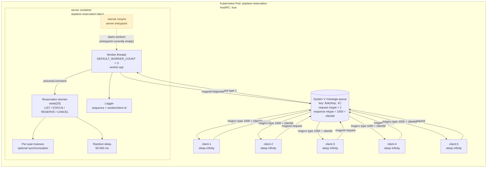
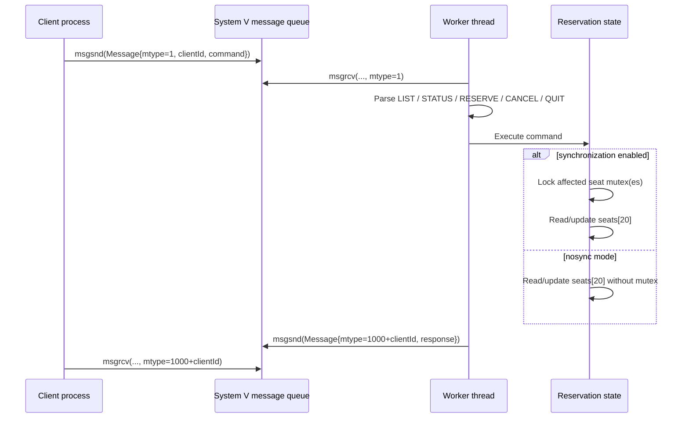

# Current Architecture

เอกสารนี้สรุป architecture จากโค้ดและ manifest ที่มีอยู่ใน repository ณ วันที่ 2026-09-02

## Overview

## Request flow

## Components and responsibilities

| Component | Responsibility | Source |
| --- | --- | --- |
| `server` | Intended process entrypoint; Kubernetes passes `nosync` | `src/server/server.cpp`, `k8s/pod.yaml` |
| Worker pool | Consumes request messages, dispatches commands, sends responses | `src/server/worker.cpp` |
| Reservation domain | In-memory seat state, validation, reserve/cancel/status/list operations | `src/reservation/reservation.cpp` |
| Synchronization | One `std::mutex` per seat when enabled | `src/reservation/reservation.cpp` |
| Message contract | Fixed-size request/response payload and message types | `src/models/message.h`, `src/constants/constants.h` |
| Logger | Serialized console logs with sequence number | `src/utils/logger.cpp` |
| Delay | Simulates 50–500 ms operation delay | `src/utils/delay.cpp` |
| Clients | Intended command-line clients; five Kubernetes containers are provisioned | `src/client/client.cpp`, `k8s/pod.yaml` |
| Load test | Concurrently sends `STATUS` requests and measures throughput/latency | `src/load_test/load_test.cpp` |

## Current-state notes

- Seat state is in the server process memory (`seats[20]`); there is no database or persistent storage.
- All workers in the server process share the same seat array and per-seat mutexes.
- Clients communicate through the same System V queue. Responses are routed by `1000 + clientId`.
- The Kubernetes manifest creates one Pod with one server container and five client containers, and sets `hostIPC: true`.
- The manifest starts the server with `nosync`, so the intended runtime path is the unsynchronized branch.
- `src/server/server.cpp` and `src/client/client.cpp` are currently empty. The worker/domain code exists, but the executable entrypoints are not implemented yet.
- `Dockerfile` copies `server.cpp` and `client.cpp` from the repository root, while the files are under `src/server/` and `src/client/`; the image build is therefore not aligned with the current source layout.
- `Makefile` builds `server` from the worker, reservation, logger, and delay modules, and builds `client` from `src/client/client.cpp`. It does not currently build `src/load_test/load_test.cpp`.

## Key constants

- 20 seats
- 3 default worker threads
- Request message type `1`
- Response message type `1000 + clientId`
- Queue key source `/tmp` with project id `'A'`
- Simulated delay between 50 and 500 ms
